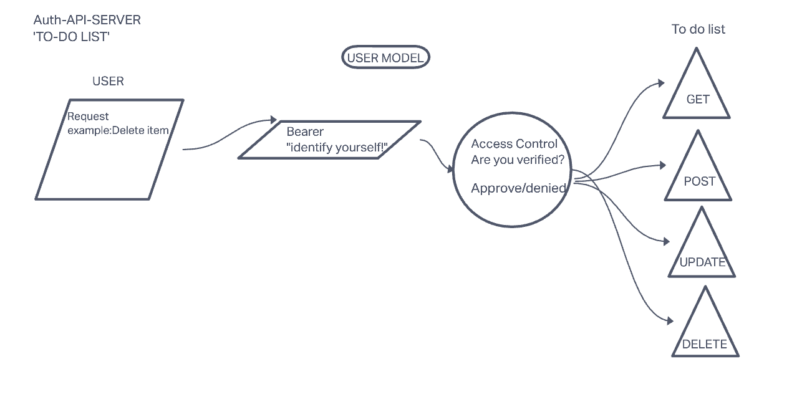

# lab9-CRUD-AUTH-server
Rey and Mike lab 08 project

3-31-22
11:20 - Met to discuss project ideas/

11:25 - Tasked with building a CRUD capable server that provides authorization.

11:30 - Michaels idea: to do list requiring auth to perform CRUD.

11:45 - Rey ideas: Twitter clone with note taking to do list with a two person chat.

11:55 - Decided two-person encrypted chat app.

1:25 - decided to do Auth CRUD Server To Do list

1:45 - sought feedback from instructor Jacob and assistant instructor Ryan for valid options

1:55 - Rey attended lecture on jest. Michael decided to not attend lecture and prepare the lab repo

3:00 - Rey returns from lecture on jest, asks for 10 min break, Michael agrees.

3:10 - Rey returns from 10 min break.
       Discussed and agreed to pull folder straight from class repo instead of manual copying to reduce errors.

4:30 - break

4:40 - break finished

Requirements
Your application must employ the following programming concepts:

## API/Auth server must deployed to Heroku
[heroku]()

Used API server to perform database operations

Used login/auth/acl to control access to resources

## [Google doc](https://docs.google.com/document/d/1wsUU4DYcN0ZN13N7iCrOBs61ZImt9NikzwyvC-LzSm8/edit?usp=sharing)

## [Presentation Slide Deck](https://docs.google.com/presentation/d/1wL4-YznWNWUqwGxZwVm9rXOMnkB4acqfkGfItyzhkGw/edit?usp=sharing)

MOnday, our team will present a working version of our project to the class showcasing the following:

- General Functionality
- Wiring (quick overview)
- Code Review

## What our app can do:

- A command line application that allows a user to create and edit a to do list after they:
- Create an account with a password
- Login with an account
- Edit account details
- Delete an account
- CRUD a 'to do' list

[UML Link](https://nicholasm734954.invisionapp.com/freehand/Lab-09-UML-JnTZU5yw5?dsid_h=d11ca5c683adf79bc05df845c734b49aa958d6c6bd288487cc3c4c7aa2154e54&uid_h=ddedb533e3da7785b77b33df291811a8fcde1503979fab0b52ecf3781e81f767)

